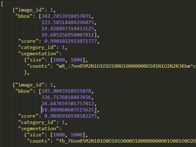
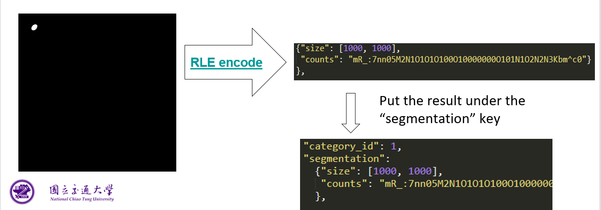

# 2021_VRDL_HW3

2021 VRDL HW3 Instance Segmentation - Nuclei segmentation  
Codalab Link: <https://codalab.lisn.upsaclay.fr/competitions/333?secret_key=3b31d945-289d-4da6-939d-39435b506ee5>

## Introduction

Train an instance segmentation model to detect and segment all the nuclei in the image. In this work, the nuclei in each image are small and enormous. In the kaggle competition, the main directions are using Unet and Mask R-CNN. I finally choose Mask R-CNN as my model.

## Dataset

Nuclear segmentation dataset contains 24 training images with 14,598 nuclear and 6 test images with 2,360 nuclear.  
Download: <https://drive.google.com/file/d/1nEJ7NTtHcCHNQqUXaoPk55VH3Uwh4QGG/view>  
Kaggle competition: <https://www.kaggle.com/c/data-science-bowl-2018/discussion>

## Environment

### Hardware

OS: Window 10  
GPU: NVIDIA GeForce RTX 2080 Ti

### Installation

```bash
pip install -r requirements.txt
```

## Methodology

### Data Pre-process

Due to the limit of my GPU, I divide image into 4 parts and do the same transform on mask. The divide also decrease the redundant background in mask.  After read image and mask, I normalize image and mask to range [0, 1] with dividing by 255. The finally package mask and other information into target. This part can see in `dataset.py`.

### Model Architecture

Mask R-CNN (ResNet-50 + FPN) and Mask R-CNN (ResNet-101 + FPN)

- [TORCHVISION OBJECT DETECTION FINETUNING TUTORIAL](https://pytorch.org/tutorials/intermediate/torchvision_tutorial.html#defining-your-model)

### Hyperparameters

I use Adam with learning rate 1e-4 and 1e-5 as my optimizer. The first 60 epochs use learning rate 1e-4 and remaining epochs use learning rate 1e-5. This is done by lr_scheduler provided by torchvision and can see in `model.py`.

### Data Post-process

#### Reconsruct the divided parts

In training part, I divide image and mask into 4 parts due to the limit of my GPU memory. Identically, I divide the input image into 4 parts, then predict each part. When all parts in image are done, I concatenate each parts into correct position and will find some nuclei has been divided. However, I didn't figure out good solution to concatenate, so I only concatenate each parts into correct position and didn't deal with some divided nuclei.

#### Answer Format

Format is same as [COCO Dataset](https://cocodataset.org/#format-results) and set the category_id = 1.  


Segmentation result need to encode by [RLE](https://github.com/cocodataset/cocoapi/blob/master/PythonAPI/pycocotools/mask.py#L80).  


## Table of Experiment Results

Using AP@0.5, IoU=.50 means set .50 as threshold of IoU.
| Model      | Backbone         | AP      |
| ---------- | ---------------- | ------- |
| Mask R-CNN | ResNet-50 + FPN  | 0.20628 |
| Mask R-CNN | ResNet-101 + FPN | 0.14182 |

## Best Model Weights

Mask R-CNN (ResNet-50 + FPN)

- <https://drive.google.com/file/d/17wpBJ5M0FB3xFWNmLOTPRsfdWl6Y4Ebu/view?usp=sharing>

## Analyze

The Mask R-CNN with ResNet-101 + FPN should be better or at least perform as great asMask R-CNN with ResNet-50 + FPN, but the result show the opposite result. This must be something wrong, but I still not find the problem so far.
I try divide image into 4 parts and 16 parts to train and to predict, divide into 16 parts have an advantage with limited GPU memory, but result almost as same as divide into 4 parts. In addition, divide into 16 parts will have more severe on the problem that some nuclei has been divided.

## Summary

## Reference

- kaggle

  - 5th place solution (based only on Mask-RCNN)
    - <https://www.kaggle.com/c/data-science-bowl-2018/discussion/56326>

  - mask-rcnn and instance segmentation network
    - <https://www.kaggle.com/c/data-science-bowl-2018/discussion/47690>

  - Top 5, also with the weights
    - <https://www.kaggle.com/c/data-science-bowl-2018/discussion/56316>

  - 10th place Code+Datasets (LB: 0.591) Mask R-CNN single model
    - <https://www.kaggle.com/c/data-science-bowl-2018/discussion/56238>

  - [ods ai topcoders, 1st place solution]
    - <https://www.kaggle.com/c/data-science-bowl-2018/discussion/54741>
    - <https://github.com/selimsef/dsb2018_topcoders/>

## Problem & Answer

1. using model.eval() vs torch.no_grad()  
   

2. mAP calculate

   - <https://blog.csdn.net/gongyi_yf/article/details/105884951>
